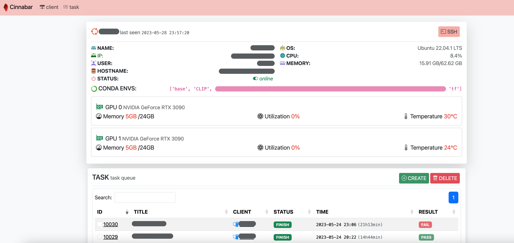

<div>
    <center>
        <h1 align="center">Cinnabar</h1>
        <p align="center">Efficiently monitor GPU resources and schedule tasks for optimal performance.</p>
    </center>
</div>




## Usage
Clone the git repo:
```bash
git clone https://github.com/preminstrel/cinnabar.git
```

Install the packages:

```bash
pip install .
```

Run the cinnabar server:
```bash
cinnabar
```

Then visit `http://localhost:8500` in your browser.

If you want to use debug mode, run:
```bash
flask --app cinnabar_server --debug run --port 8500 --host 127.0.0.1
```